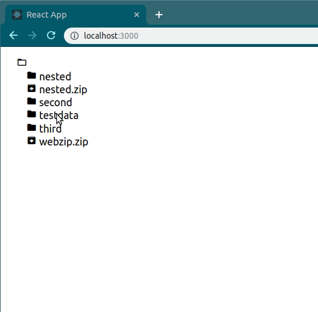

# DirectoryViewer

## Overview

Web app which allows you to explore a directory in browser.



## Run

To run this application, follow these steps:

1. Build server jar
   ```bash
   cd server/ && ./gradlew bootJar && cd ..
   ```
2. Start the server specifying the root directory
   ```bash
   java -jar server/build/libs/directoryviewer-0.0.1-SNAPSHOT.jar --directoryviewer.fsroot=<path, e.g. /home/username/dir>
   ```
3. Run React app
   ```bash
   cd client
   npm install
   npm start
   ```
4. Open http://localhost:3000 to explore
